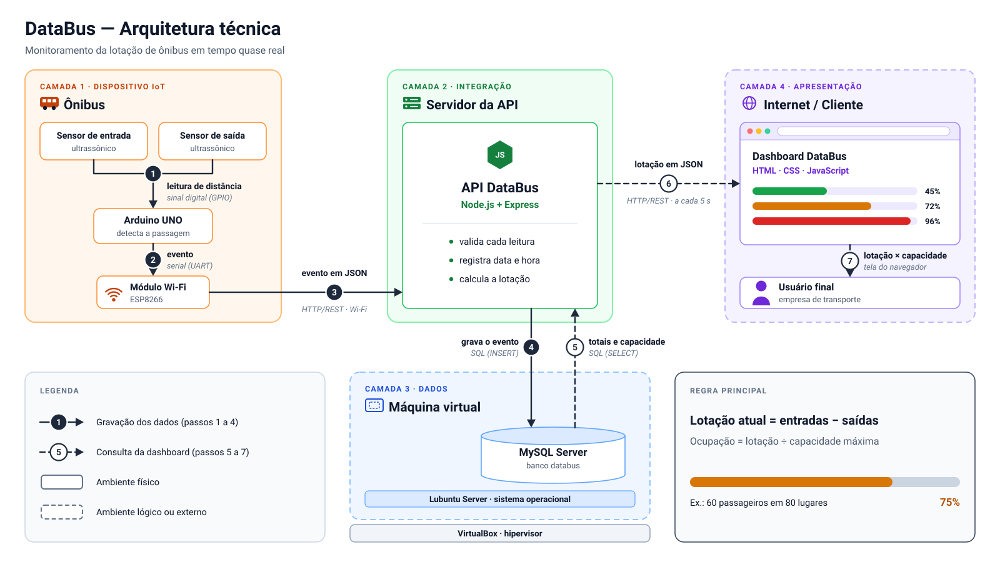

# DataBus — Arquitetura técnica

Monitoramento da lotação de ônibus em tempo quase real — projeto acadêmico de Análise e Desenvolvimento de Sistemas (ADS).

| Arquivo | Uso |
|---|---|
| [`databus-arquitetura.svg`](databus-arquitetura.svg) | Diagrama vetorial para a documentação. Pode ser inserido como imagem (Word, PowerPoint, draw.io) ou ter o código colado direto em uma página HTML. Não usa CSS nem scripts, só atributos SVG, para abrir igual em qualquer ferramenta. |
| [`databus-arquitetura.png`](databus-arquitetura.png) | Mesma imagem em PNG (3520 × 2020) para ferramentas que não aceitam SVG, como Google Slides e Canva. |

**Regra principal:** lotação atual = total de entradas − total de saídas. Ocupação (%) = lotação atual ÷ capacidade máxima do ônibus × 100.

## 1. Legenda

### Componentes

| Camada · ambiente | Componente | Tecnologia | Função |
|---|---|---|---|
| 1 · Ônibus | Sensores ultrassônicos (um por porta) | HC-SR04 | Medem a distância até o piso; a queda brusca da distância indica a passagem de um passageiro. |
| 1 · Ônibus | Microcontrolador | Arduino UNO (firmware em C/C++) | Lê os sensores, confirma a passagem e gera o evento de entrada ou de saída. |
| 1 · Ônibus | Módulo Wi-Fi | ESP8266 (ESP-01) | Conecta o Arduino à rede e envia cada evento à API. |
| 2 · Servidor da API | API DataBus | Node.js + Express | Recebe e valida os eventos, registra data e hora, grava e consulta o banco, calcula a lotação e entrega os arquivos do site. |
| 3 · Máquina virtual | Banco de dados | MySQL Server | Guarda empresas, ônibus (com a capacidade máxima) e eventos. |
| 3 · Máquina virtual | Sistema e virtualização | Lubuntu Server sobre VirtualBox | Ambiente isolado que hospeda o MySQL dentro do computador hospedeiro. |
| 4 · Internet / Cliente | Site / dashboard | HTML, CSS e JavaScript | Consulta a API periodicamente e mostra a lotação × capacidade de cada ônibus. |
| 4 · Internet / Cliente | Usuário final | Navegador web | Empresa de transporte que acompanha a ocupação da frota. |

### Setas numeradas

| Nº | Origem → destino | O que trafega | Protocolo / meio |
|---|---|---|---|
| 1 | Sensores → Arduino | Pulso de eco cuja duração indica a distância | Sinal digital nos pinos GPIO (Trig/Echo), por fios |
| 2 | Arduino → Módulo Wi-Fi | Evento: identificação do ônibus, porta e tipo (entrada/saída) | Comunicação serial (UART) |
| 3 | Módulo Wi-Fi → API | `POST /api/eventos` com o evento em JSON | HTTP/REST via Wi-Fi + internet |
| 4 | API → MySQL | `INSERT` do evento com data e hora | Conexão SQL (driver `mysql2`), TCP 3306 |
| 5 | Dashboard → API | `GET /api/lotacao`, a cada 5 s | HTTP/REST (`fetch()` no navegador) |
| 6 | MySQL → API | Resultado do `SELECT`: totais de entradas e saídas e capacidade | Conexão SQL, TCP 3306 |
| 7 | API → Dashboard | JSON com lotação atual, capacidade e % de ocupação | HTTP/REST (resposta) |
| 8 | Dashboard → Usuário | Lotação × capacidade em gráficos e indicadores | Interface no navegador |

Convenções do desenho: seta contínua com número em círculo cheio = fluxo de gravação (1–4); seta tracejada com número em círculo vazado = fluxo de consulta (5–8); borda contínua = ambiente físico; borda tracejada = ambiente lógico ou externo; texto em itálico = protocolo ou meio de comunicação.

## 2. Fluxo de ponta a ponta

O fluxo do DataBus começa dentro do ônibus. Sensores ultrassônicos HC-SR04 instalados acima das portas de entrada e de saída medem continuamente a distância até o piso e enviam pulsos de eco ao Arduino UNO (1); quando a distância cai e depois volta ao normal, o firmware reconhece a passagem de um passageiro e gera um evento de entrada ou de saída. O evento, com a identificação do ônibus, a porta e o tipo, segue por comunicação serial até o módulo Wi-Fi ESP8266 (2), que o envia pela rede sem fio e pela internet à API DataBus em uma requisição HTTP POST com corpo em JSON (3). A API, desenvolvida em Node.js com Express, valida os dados, registra a data e a hora do evento e o grava no banco MySQL (4), executado em uma máquina virtual Lubuntu Server no VirtualBox. Do lado do cliente, a dashboard do site DataBus (HTML, CSS e JavaScript), aberta no navegador da empresa de transporte, consulta a mesma API a cada poucos segundos (5). A API busca no banco os totais de entradas e de saídas e a capacidade de cada ônibus (6), calcula a lotação atual (total de entradas menos total de saídas) e o percentual de ocupação em relação à capacidade máxima, e devolve esses valores em JSON (7). Por fim, a dashboard apresenta a lotação de cada ônibus em gráficos e indicadores (8), permitindo à empresa acompanhar a ocupação da frota em tempo quase real.

## 3. Premissas adotadas no diagrama

Pontos que a descrição do projeto não definia e que o diagrama assume. Ajuste se a equipe decidir de outro jeito.

- **Módulo ESP8266 (ESP-01) ligado por serial ao Arduino**, porque o Arduino UNO não tem Wi-Fi próprio.
- **Sensor HC-SR04**, o modelo ultrassônico mais comum para Arduino.
- **Data e hora registradas pela API** quando o evento chega, porque o Arduino UNO não tem relógio.
- **Consulta da dashboard a cada 5 s** (polling), suficiente para "tempo quase real".
- **Site entregue pelo mesmo servidor Express da API** (arquivos estáticos); é assim que o site "consulta os dados por meio da própria API".
- **Tabelas mínimas:** `empresa`, `onibus` (com `capacidade_maxima`) e `evento` (ônibus, porta, tipo, data e hora).

## 4. Lacunas e inconsistências técnicas

Ficam fora do diagrama principal. Estão em ordem de impacto, cada uma com uma solução simples, adequada a um projeto acadêmico.

### Para o sistema funcionar

**1. Conexão com o ônibus em movimento.**
*Problema:* o ESP-01 só alcança uma rede Wi-Fi a algumas dezenas de metros. Na rua não existe rede fixa, e o sinal cai em túneis e áreas sem cobertura; cada evento perdido deixa a lotação errada até o fim do dia.
*Solução:* instalar no ônibus um roteador 4G (no protótipo, um celular em modo hotspot). O ESP-01 se conecta a essa rede local e chega à API pela internet móvel, sem mudar a arquitetura de software. No firmware, guardar os eventos em uma fila pequena na memória (por exemplo, 50 eventos) e só retirá-los quando a API confirmar o recebimento (HTTP 201); se o envio falhar, o evento é reenviado quando a conexão voltar. Cada evento leva um número sequencial por ônibus, e a API ignora duplicados (chave única ônibus + sequência).
*Alternativa ainda mais simples:* em vez de um evento por passagem, enviar a cada poucos segundos os contadores acumulados da viagem (entradas e saídas). Uma mensagem perdida é corrigida pela seguinte.

**2. Arduino UNO sem Wi-Fi (premissa do diagrama).**
*Problema:* o UNO não tem rede própria. O ESP-01 resolve, mas trabalha em 3,3 V: o pino de 3,3 V do UNO não fornece corrente suficiente e o pino RX do módulo não é tolerante a 5 V. Além disso, um envio HTTP por comandos AT pode levar alguns segundos, e nesse tempo o Arduino deixa de ler os sensores e pode perder passagens.
*Solução:* alimentar o ESP-01 com um regulador de 3,3 V próprio e usar um divisor de tensão no RX. No firmware, dar prioridade à leitura dos sensores e só enviar quando nenhum sensor estiver ocupado, ou acumular eventos e enviar em lote. Se a disciplina permitir trocar a placa, um Arduino UNO R4 WiFi ou um ESP32 (programado na mesma Arduino IDE) já tem Wi-Fi integrado e dispensa a ligação serial.

**3. API acessível pela internet.**
*Problema:* o ônibus (pelo 4G) e os clientes acessam a API pela internet, mas um servidor no laboratório ou em casa não tem endereço público.
*Solução:* na apresentação, colocar o protótipo, o servidor da API e a VM na mesma rede Wi-Fi (o "ônibus" vira uma maquete). Para um teste em campo, publicar a API com um túnel (ngrok ou Cloudflare Tunnel) ou hospedá-la em uma VM na nuvem com crédito estudantil.

**4. Rede da máquina virtual.**
*Problema:* no modo NAT padrão do VirtualBox a VM não aceita conexões vindas de outra máquina, e o MySQL, por padrão, só escuta conexões locais (`bind-address = 127.0.0.1`).
*Solução:* configurar a placa de rede da VM em modo Bridge (ou NAT com redirecionamento da porta 3306). No MySQL, usar `bind-address = 0.0.0.0` e criar um usuário só para a API, restrito ao IP do servidor e com permissão apenas de `SELECT` e `INSERT`. A porta 3306 nunca deve ficar exposta na internet: só a API conversa com o banco.

### Para os dados serem confiáveis

**5. Data e hora sem relógio no Arduino.**
*Problema:* o UNO não tem relógio de tempo real (RTC). Se um evento ficar na fila (lacuna 1), a hora em que ele chega à API não é a hora da passagem.
*Solução:* manter a API registrando a hora do servidor e, nos reenvios, mandar também a "idade" do evento em milissegundos (`millis()` atual menos o `millis()` da detecção); a API grava `data_hora = agora − idade`. Alternativa: um módulo RTC DS3231.

**6. Precisão da contagem com um sensor por porta.**
*Problema:* o HC-SR04 detecta presença, não direção. Duas pessoas juntas contam como uma, alguém parado sob o sensor pode ser contado várias vezes e quem desce pela porta de entrada é contado como entrada.
*Solução:* no firmware, contar uma passagem só na sequência livre → ocupado → livre, com tempo mínimo entre contagens (cerca de 300 ms) e limiar de distância calibrado na instalação. Se houver tempo, usar dois sensores por porta (A e B) e deduzir o sentido pela ordem de acionamento, disparando-os alternadamente para não interferirem entre si. Medir e relatar a taxa de erro nos testes, que é um resultado esperado em trabalho acadêmico.

**7. "Total de entradas − total de saídas" acumula erro.**
*Problema:* se o total considerar todo o histórico, cada erro de contagem se soma para sempre e a lotação pode até ficar negativa.
*Solução:* calcular por viagem ou por dia: filtrar os eventos a partir do início da viagem (ou da meia-noite), ou zerar a contagem no terminal. Exibir no mínimo zero (`GREATEST(0, ...)` no `SELECT`). Valores acima da capacidade são válidos (superlotação) e devem gerar alerta, não ser cortados.

### Segurança, operação e documentação

**8. Segurança e separação por empresa.**
*Problema:* da forma descrita, qualquer pessoa com o endereço da API consegue enviar eventos falsos ou ver os ônibus de outra empresa.
*Solução:* um token por dispositivo no cabeçalho do POST (por exemplo, `x-api-key`), conferido pela API; login para os usuários (tabela `usuario` ligada a `empresa`, senha guardada com hash bcrypt) e filtro por empresa em todas as consultas da dashboard.

**9. Alimentação elétrica no ônibus.**
*Problema:* o sistema elétrico do ônibus costuma ser de 24 V e oscila na partida do motor.
*Solução:* conversor DC-DC step-down para 5 V (ou um carregador veicular USB) no Arduino e regulador de 3,3 V dedicado ao ESP-01.

**10. Nome "Lubuntu Server".**
*Inconsistência:* o Lubuntu é distribuído como sistema desktop leve (LXQt); não existe uma edição "Server" oficial.
*Solução:* se a VM só roda o MySQL, o Ubuntu Server (sem interface gráfica) é mais leve. Se a disciplina adota o Lubuntu, basta chamá-lo de "Lubuntu" na documentação. O diagrama mantém o nome usado no projeto.
